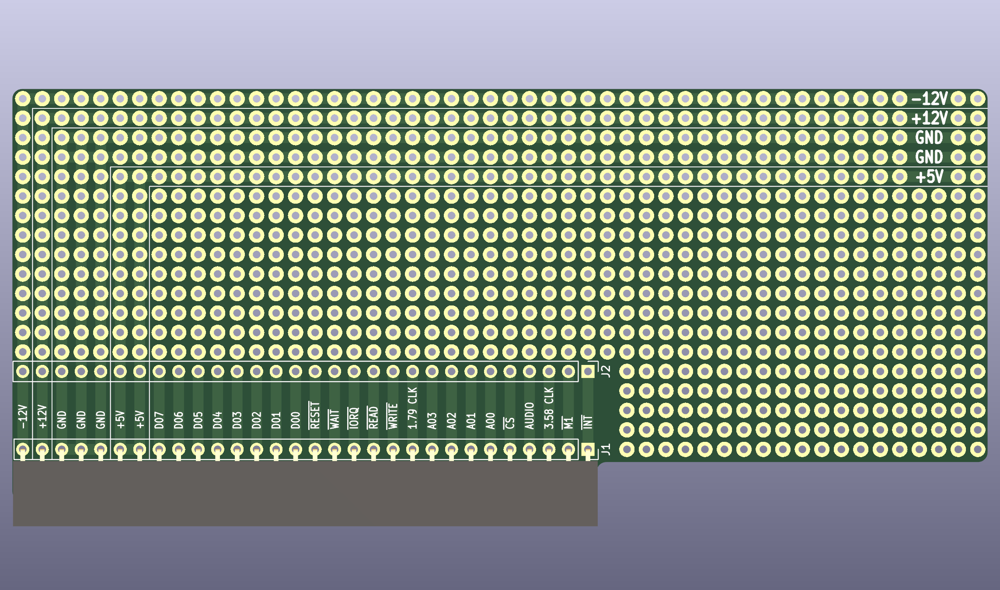

# Nabu-Proto
My take on Swiss cheese for the Nabu PC. 
A Nabu PC Prototyping Expansion Card.

## Description
My interpretation of what a Nabu PC Prototyping Expansion Card should be. Designed using KiCAD 6.0.x

### PCB Layout

### See Also
[Nabu SD Card Expansion & More!](https://github.com/ayourk/Nabu-SD/tree/main/kicad) 
[Nabu PC PCB Schematics](https://github.com/ayourk/Nabu-PC) (work in progress)
